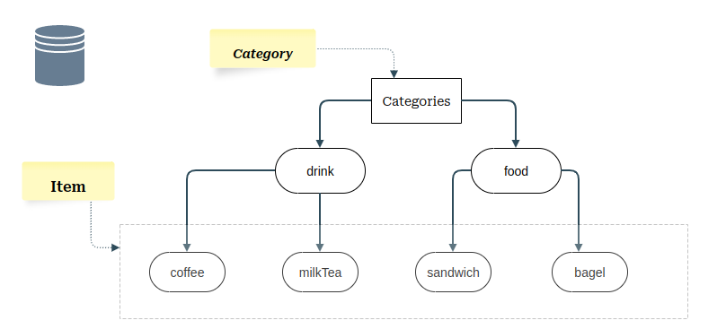

# Database


## Description

1. Hierarchy



2. Props
- Leaf props:

	> They are all information of particular item, however, they are represented in different structure. Discriptions of their structure

	1. basePrice: number

	2. type, whippedCreamTopping, chocolatePump, milk, egg, turkey, butter, creamCheeseTopping: 
		
		- represented by an object: with possible value represented by [keys], and corresponding additional price is represented by [value]

	3. constraint

		- This is information represents the constraints between other information value, such as: type.hot can not go along with size.l

		- represented by an array of constraints, each constraint is an array of 4 values:
		unary1, prop1, unary2, prop2. They are implied by: 

			`constraintValue = unary1 * prop1 && unary2 * prop2`

		- if 2 props relations is invalid, then constraint value is true, vice versa

		- Example:
			```
			constraint1 = [1, type.hot, 1, size.l]

			-> constraint1 = type.hot && size.l
			
			if type.hot is true and size.l is also true, the constraint1 is true, which means the relation between type.hot and size.l is invalid

			constraint2 = [-1, "type.hot", 1, "chocolatePump"]

			-> constraint 2 = !type.hot && chocolatePump
			```
