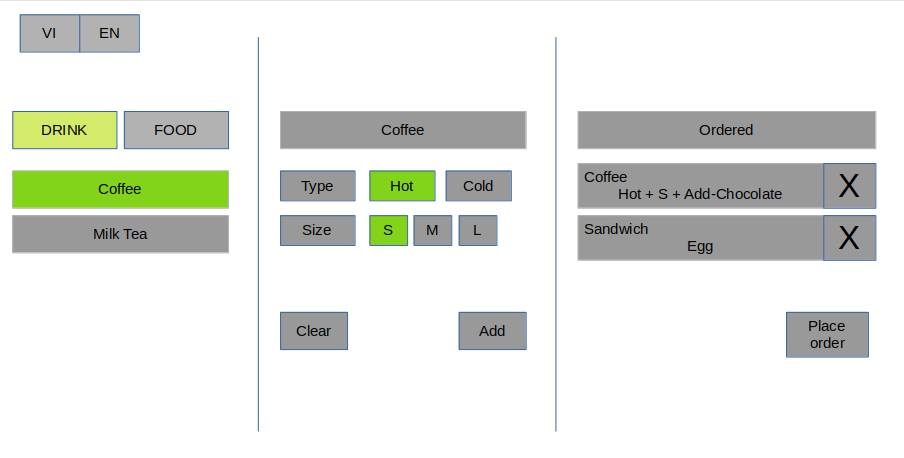
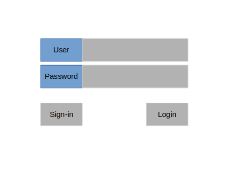
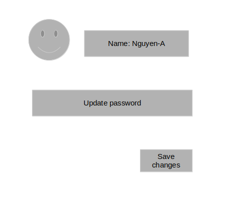
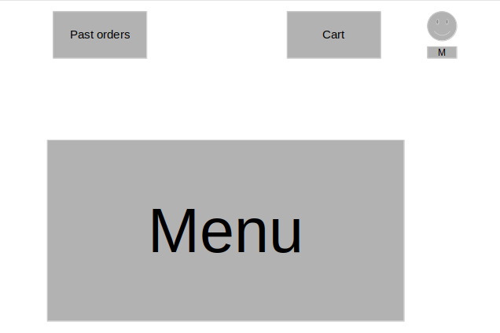
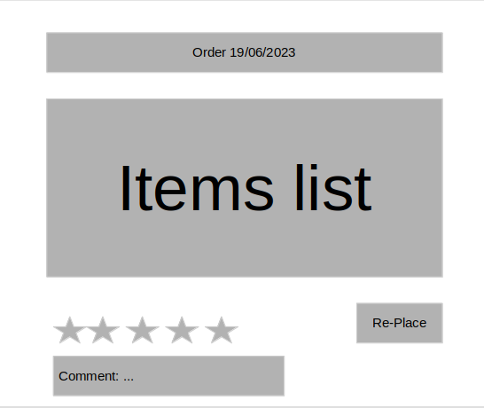
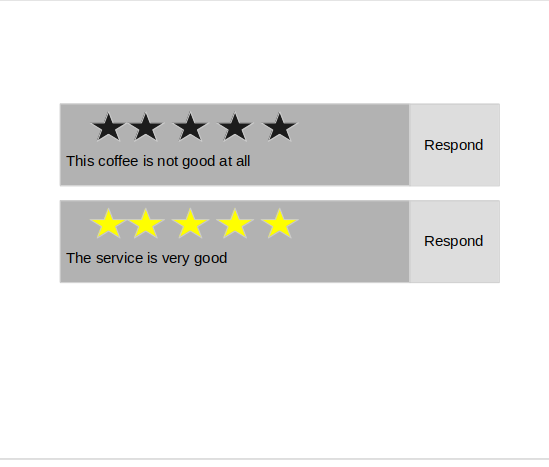

# Coffee-shop helper program

To help the coffee shop to manage the ordering of their customer
===

1. Module 1: calculate price

	- Purpose: allow cashier to calcualte price of given the information of an item

	- Use cases:
		1. When user want to buy an coffee with these info: hot, size L, adding chocolate sauce. 
			- This feature can help cashier calcualte the price of this coffee.

		2. When cashier choose the info according to customer desire: this feature can help cashier validate the info:
			- There is a constraint that hot drink only has size M or S. If customer choose hot and size L: the program can notify the cashier that: this is invalid drink info

2. Module 2: UI for cashier

	- Purpose: supply cashiers an UI so that they can graphically select item info and calculate the price of item and the UI work in both computer and mobile devices

	

	1. Feature 1: Place multiple item into an order
		- Purpose: due to the fact that: an order may contain many item -> this allow cashier can calculate total order at once.

		- User cases:
			1. A customer want to buy 1 coffee and 2 milktea cups. Cashiers can select info of each item and add it into one order.

	2. Feature 2: the UI can fit in any devices
		- Purpose: to allow user can use the UI in their mobile or computer device

		- Use cases:
			1. The waiter/waitress can use their phone to place order for customer

			2. The cashier can user shop's computer to calcualte the price of customer order

	3. Feature 3: translation VI/EN
		- Purpose: to allow user can use the UI in both Vietnamese and english

		- Use cases:
			1. A foreign customer want to see the list item in english. The vietnamese cashier can switch to EN mode for the customer to pick the desired item.

	4. Feature 4: 1 Function at a time
		- Purpose: To reduce the chance of mistakes/error that user can make

		- Use cases:
			1. When waters selects info of an item. They can do others function like placing the order, choose other item util they (1) Add the current item into order or (2) Cancel the current item.

3. Module 3: make it into cloud

	- Purpose: let the user can use the program anywhere only with access to the internet.

	- Use case:
		1. The user can access to the program in their phone or their lap without any installation.

4. Module 4: Keep track to customer

	- Purpose: allow coffee shop can keep track of their customer

	1. Feature 1: Manage account 
		- Purpose: allow to manage accounts and provide corresponding features for specific user

		

		

		- Use cases:
			1. For all users: they can register, login, and manage their profile

			2. For customer: they can view their current and past order; re-place the order

			3. For cashiers: they can see list of all current orders in the coffee-shop and pricing any of them.

	2. Feature 2: account for customer
		- Purpose: provide for customer specific functions

		

		1. Feature 2-1: place order
			- Purpose: Allow the customer can place order themselves 

			- Use cases:
				1. A customer can use their mobile phone, access to the app on web, select items and place the order.

		2. Feature 2-2: view the past orders and re-place them
			- Purpose: allow customer can view the past order and re-place the order

			- Use cases:
				1. When familiar customer want to re-order his/her favorite items. He/she can view their old order and re-place it again

		3. Feature 2-3: user can give comment and rate any past order
			- Purpose: user can express their feeling about the services and manager can analyze customer desire to server bettter services

			

			- Use cases:
				1. After having servered, customer can view the past order, rate and comment for that order

	3. Feature 3: authorized user

		1. Feature 1: view rating and comments by the customer/store/barista

			- Purpose: to allow authorized user can analyze the customer desire and provide better services

			

			- Use case:
				1. Manager can list all rating-comment and respond to chosen comment